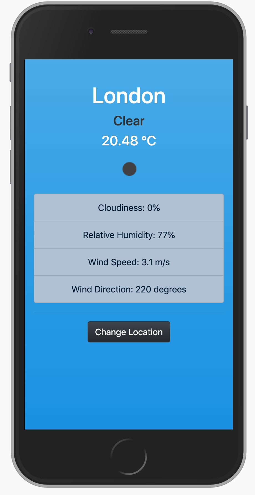
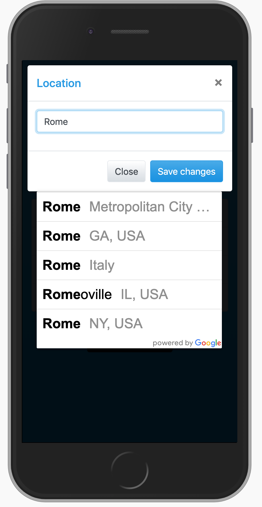

## How to set up the Weather App on your computer:
1. Download the repository's ZIP file and unzip it.
2. Go inside the 'public' folder and open 'index.html' with your browser.
3. Make sure to dress accordingly! 

## Responsive app:
The App has been developed using responsive layouts in order to fit various devices.

## This is how Weather App looks like:

